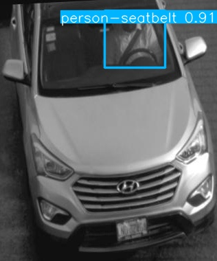
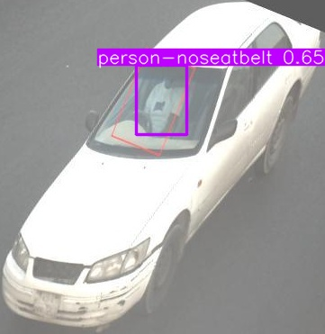

# Seatbelt Compliance Monitor

A comprehensive computer vision pipeline for detecting vehicles, analyzing seatbelt compliance, and extracting license plate information from images. The system uses multiple YOLO models and OCR to process vehicle images and automatically identify seatbelt violators with identifiable license plates for traffic safety enforcement.

## Features

- **Car Detection**: Automatically detects and crops cars from images using YOLO11n
- **Seatbelt Detection**: Identifies whether occupants are wearing seatbelts
- **License Plate Detection & OCR**: Detects and extracts text from license plates
- **Violator Reporting**: Generates a separate JSON file containing only seatbelt violators with identifiable license plates
- **Batch Processing**: Process single images or entire directories
- **Configurable Thresholds**: Adjustable confidence levels for all detection stages

## Project Structure

```
Car_Seatbelt_Compliance_Monitor/
├── Assets/                   # Example images for documentation
│   ├── seatbelt.jpg          # Example: Seatbelt detected
│   └── no-seatbelt.jpg       # Example: No seatbelt detected
├── src/
│   ├── car_detection/        # Car detection module
│   ├── seatbelt_detection/   # Seatbelt detection module
│   ├── license_plate/        # License plate detection and OCR
│   └── pipeline/             # Pipeline orchestration
├── output/                   # Generated outputs
│   ├── cars_annotated/       # Car detection annotations
│   ├── cars_cropped/         # Cropped car images
│   ├── seatbelt_annotated/   # Seatbelt detection annotations
│   ├── plates_annotated/     # License plate annotations
│   ├── plates_cropped/       # Cropped plate images
│   ├── results.json          # Full results (all cars)
│   └── violators.json        # Violators only
├── main.py                   # Main entry point
├── pyproject.toml            # Project dependencies
└── README.md                 # This file
```

## Models Used

### 1. Car Detection Model
- **Model**: YOLO11n (`yolo11n.pt`)
- **Purpose**: Detect and localize vehicles in images
- **Class**: Car (class 2)
- **Source**: Ultralytics YOLO11 pre-trained model

### 2. License Plate Detection Model
- **Model**: YOLOv11-License-Plate Detection (`license-plate-finetune-v1n.pt`)
- **Purpose**: Detect license plates on cropped car images
- **Source**: [Hugging Face - morsetechlab/yolov11-license-plate-detection](https://huggingface.co/morsetechlab/yolov11-license-plate-detection)
- **Dataset**: Roboflow License Plate Recognition Dataset (10,125 images)
- **Performance**: 
  - Precision: 0.9893
  - Recall: 0.9508
  - mAP@50: 0.9813

### 3. Seatbelt Detection Model
- **Model**: Custom-trained YOLO11n (`seat_belt_fast/10_epoch_m3/weights/best.pt`)
- **Purpose**: Detect seatbelt usage (person-seatbelt, person-noseatbelt, seatbelt)
- **Training**: Custom fine-tuned on Roboflow seatbelt detection dataset
- **Classes**: 
  - Class 9: person-noseatbelt
  - Class 10: person-seatbelt
  - Class 11: seatbelt

### 4. OCR Engine
- **Library**: EasyOCR
- **Purpose**: Extract text from detected license plates
- **Language**: English

## Detection Examples

The pipeline can accurately detect seatbelt compliance status. Below are example outputs:

### Seatbelt Detected ✅



*Example showing successful seatbelt detection with bounding boxes highlighting the detected seatbelt.*

### No Seatbelt Detected ❌



*Example showing detection of a person without a seatbelt, which would be flagged as a violator if license plate is identifiable.*

## Prerequisites

- Python >= 3.12
- [uv](https://github.com/astral-sh/uv) package manager
- GPU (optional, recommended for faster processing)

## Setup

### 1. Install uv (if not already installed)

```bash
# macOS/Linux
curl -LsSf https://astral.sh/uv/install.sh | sh

# Windows (PowerShell)
powershell -c "irm https://astral.sh/uv/install.ps1 | iex"
```

### 2. Clone the repository

```bash
git clone <repository-url>
cd Car_Seatbelt_Compliance_Monitor
```

### 3. Install dependencies

```bash
uv sync
```

This will:
- Create a virtual environment
- Install all project dependencies from `pyproject.toml`
- Install development dependencies if applicable

### 4. Download Models

Ensure you have the following model files:

1. **YOLO11n** (`yolo11n.pt`) - Automatically downloaded on first use
2. **License Plate Model** - Download from [Hugging Face](https://huggingface.co/morsetechlab/yolov11-license-plate-detection) and save to your desired location. Update the `--plate-model` path accordingly.
3. **Seatbelt Model** - Place your trained seatbelt detection model in your desired location. Update the `--seatbelt-model` path to point to your model file (e.g., `path/to/your/seatbelt/model.pt`).

## Usage

### Basic Usage

```bash
# Process a directory of images
python main.py path/to/images/

# Process a single image
python main.py path/to/image.jpg

# With custom output directory
python main.py path/to/images/ --output my_results

# With custom JSON filenames
python main.py path/to/images/ \
  --json-name full_results.json \
  --violators-json-name violations.json
```

### Advanced Usage

```bash
# Example with custom model paths (update paths to your actual model locations)
python main.py path/to/images/ \
  --output results_output \
  --json-name results.json \
  --violators-json-name violators.json \
  --car-conf 0.5 \
  --seatbelt-conf 0.6 \
  --plate-conf 0.45 \
  --car-model yolo11n.pt \
  --seatbelt-model path/to/your/seatbelt/model.pt \
  --plate-model path/to/your/license-plate/model.pt \
  --no-gpu
```

### Command-Line Arguments

| Argument | Type | Required/Optional | Default Value | Description |
|----------|------|-------------------|---------------|-------------|
| `input_path` | `str` | Required | - | Path to input image file or directory containing images |
| `--output`, `-o` | `str` | Optional | `output` | Directory path for output JSON files and intermediate results |
| `--json-name`, `-j` | `str` | Optional | `results.json` | Name of the output JSON file containing all results |
| `--violators-json-name`, `-v` | `str` | Optional | `violators.json` | Name of the violators JSON file (only seatbelt violators with plates) |
| `--car-conf` | `float` | Optional | `0.4` | Confidence threshold for car detection |
| `--seatbelt-conf` | `float` | Optional | `0.55` | Confidence threshold for seatbelt detection |
| `--plate-conf` | `float` | Optional | `0.4` | Confidence threshold for license plate detection |
| `--car-model` | `str` | Optional | `yolo11n.pt` | Path to car detection YOLO model |
| `--seatbelt-model` | `str` | Optional | `seat_belt_fast/10_epoch_m3/weights/best.pt` | **Path to your seatbelt detection model** - Update this to point to your trained model location |
| `--plate-model` | `str` | Optional | `license-plate-finetune-v1n.pt` | **Path to your license plate detection model** - Update this to point to your downloaded model location |
| `--gpu` / `--no-gpu` | `bool` | Optional | `--gpu` (True) | Use GPU for EasyOCR (default: GPU enabled, use `--no-gpu` to disable) |

## Output Format

### Full Results JSON (`results.json`)

Contains all detected cars with their plate text and seatbelt status:

```json
{
  "image1.jpg": [
    {
      "plate": "ABC123",
      "seatbelt": true
    },
    {
      "plate": "XYZ789",
      "seatbelt": false
    }
  ],
  "image2.jpg": [
    {
      "plate": "None",
      "seatbelt": true
    }
  ],
  "image3.jpg": []
}
```

**Fields:**
- `plate`: Extracted license plate text or `"None"` if not detected/extracted
- `seatbelt`: Boolean indicating seatbelt presence (`true` = seatbelt detected, `false` = no seatbelt)

### Violators JSON (`violators.json`)

Contains only cars that:
- Have `seatbelt: false` (no seatbelt detected)
- Have `plate != "None"` (identifiable license plate)

```json
{
  "image1.jpg": [
    {
      "plate": "XYZ789",
      "seatbelt": false
    }
  ],
  "image2.jpg": [
    {
      "plate": "@poLCR0607",
      "seatbelt": false
    }
  ]
}
```

### Intermediate Outputs

The pipeline also saves intermediate results for debugging and visualization:

- `output/cars_annotated/`: Images with car bounding boxes
- `output/cars_cropped/`: Individual cropped car images
- `output/seatbelt_annotated/`: Car images with seatbelt detection annotations
- `output/plates_annotated/`: Car images with license plate annotations
- `output/plates_cropped/`: Individual cropped license plate images

## Example Workflow

1. **Input**: Directory containing vehicle images
2. **Car Detection**: YOLO11n detects and crops all cars
3. **For each car**:
   - **Seatbelt Detection**: Custom model checks for seatbelt usage
   - **License Plate Detection**: YOLOv11 license plate model detects plates
   - **OCR**: EasyOCR extracts text from plates
4. **Output Generation**:
   - Full results saved to `results.json`
   - Violators filtered and saved to `violators.json`

## Performance Tips

1. **GPU Usage**: Enable GPU for EasyOCR (default) for faster text extraction
2. **Batch Processing**: Process multiple images in one run for efficiency
3. **Confidence Tuning**: Adjust confidence thresholds based on your use case:
   - Lower thresholds = more detections (may include false positives)
   - Higher thresholds = fewer detections (may miss some objects)

## Troubleshooting

### Model Not Found
Ensure all model files are accessible and update the paths in the command:
- `yolo11n.pt` (downloaded automatically, or specify path with `--car-model`)
- License plate model (download from [Hugging Face](https://huggingface.co/morsetechlab/yolov11-license-plate-detection) and specify path with `--plate-model`)
- Seatbelt model (specify your trained model path with `--seatbelt-model`)

### No Cars Detected
- Lower the `--car-conf` threshold (e.g., `--car-conf 0.3`)
- Verify image quality and car visibility

### No Plates Detected
- Lower the `--plate-conf` threshold
- Ensure plates are clearly visible in cropped car images

### OCR Issues
- Ensure license plates are clear and readable
- Try using GPU if available (`--gpu`)
- EasyOCR may have difficulty with very blurry or distorted plates

